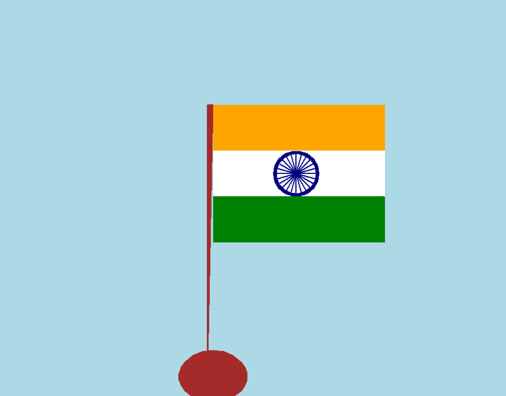

# python-turtle-flag
 A Python Turtle Graphics project to draw a flag
 # 🐢 Python Turtle Flag 🇮🇳

 
 


A creative project using **Python Turtle Graphics** to draw the Indian National Flag 🇮🇳.  
This project was developed as part of a competition for **Indian Independence Day 🇮🇳**, where it won **3rd Prize 🥉**.  

---

## 🚀 How to Run
🖥️ Follow these steps to run the project on your system:  

1. **Clone the Repository**  
   ```bash
   git clone https://github.com/ANAGHA-A-04/python-turtle-flag.git
   cd python-turtle-flag
## 📸 Preview



🛠️ Built With
Python 3

Turtle Graphics

🏆 Achievements
🥉 Third Prize Winner in the Indian Independence Day Programming Competition
🗓️ August 2024

📚 What I Learned
✅ Using the Turtle library for graphics programming
✅ Drawing complex shapes and patterns programmatically
✅ Basics of coordinate systems in Turtle
✅ How to participate and excel in coding competitions

📌 Author
👩‍💻 Anagha A
🌐 GitHub
